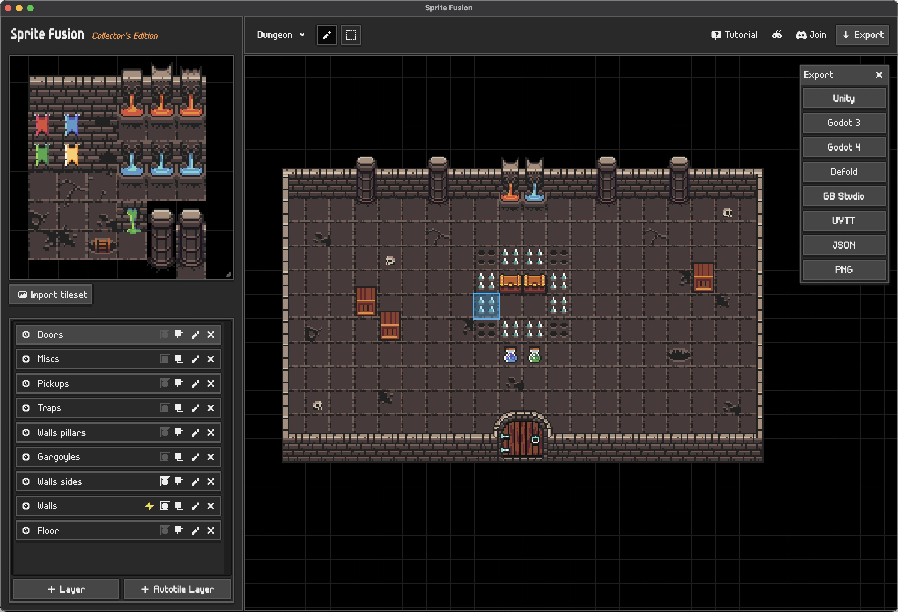

# Sprite Fusion Bevy Plugin

A [Bevy](https://bevyengine.org/) plugin for loading and rendering [Sprite Fusion](https://www.spritefusion.com/) maps.

[](https://crates.io/crates/bevy_spritefusion)
[](https://docs.rs/bevy_spritefusion)
[](LICENSE)



## Why ?

**Sprite Fusion is a free, web-based tilemap editor with a strong focus on simplicity.**

- **Layer Support**: Each SpriteFusion layer becomes a separate tilemap with proper Z-ordering
- **Collisions support**: Layers marked as colliders get a `Collider` component on their tiles
- **Custom tiles attributes**: Custom attributes from SpriteFusion are preserved and queryable
- **Advanced features**: Auto tiling, bucket fill, save and load maps, etc.

## Quick Start

### 1. Add the dependency

```toml
[dependencies]
bevy_spritefusion = "0.1"
```

### 2. Export from SpriteFusion

Export your map from Sprite Fusion via the Bevy export button. You'll get:

- `map.json`, The tilemap data
- `spritesheet.png`, The generated tileset

Place both files in your `assets/` folder.

### 3. Load and spawn the map

```rust
use bevy::prelude::*;
use bevy_spritefusion::prelude::*;

fn main() {
    App::new()
        .add_plugins(DefaultPlugins.set(ImagePlugin::default_nearest()))
        .add_plugins(SpriteFusionPlugin)
        .add_systems(Startup, spawn_map)
        .run();
}

fn spawn_map(mut commands: Commands, asset_server: Res<AssetServer>) {
    commands.spawn(Camera2d);
    commands.spawn(SpriteFusionBundle {
        map: SpriteFusionMapHandle(asset_server.load("map.json")),
        tileset: SpriteFusionTilesetHandle(asset_server.load("spritesheet.png")),
        ..default()
    });
}
```

## Querying tiles

### Find tiles with collisions

```rust
use bevy::prelude::*;
use bevy_spritefusion::prelude::*;

fn find_colliders(query: Query<&TilePos, With<Collider>>) {
    for pos in query.iter() {
        println!("Collider at ({}, {})", pos.x, pos.y);
    }
}
```

### Query tiles attributes

SpriteFusion allows you to attach custom attributes to tiles. These are preserved as `TileAttributes` components:

```rust
fn find_collectibles(query: Query<(&TilePos, &TileAttributes)>) {
    for (pos, attrs) in query.iter() {
        if attrs.get_bool("isCollectible").unwrap_or(false) {
            let name = attrs.get_str("name").unwrap_or("unknown");
            let value = attrs.get_i64("value").unwrap_or(0);
            println!("{} at ({}, {}) worth {}", name, pos.x, pos.y, value);
        }
    }
}
```

### Query by layer

```rust
fn find_layer(query: Query<(Entity, &SpriteFusionLayerMarker)>) {
    for (entity, layer) in query.iter() {
        println!("Layer '{}' (index: {}, collider: {})",
            layer.name, layer.index, layer.collider);
    }
}
```

## Sprite Fusion JSON Format

The plugin expects the standard SpriteFusion JSON export format:

```json
{
	"tileSize": 16,
	"mapWidth": 38,
	"mapHeight": 14,
	"layers": [
		{
			"name": "Ground",
			"collider": true,
			"tiles": [
				{ "id": "0", "x": 5, "y": 11 },
				{ "id": "1", "x": 6, "y": 11, "attributes": { "isSpawn": true } }
			]
		}
	]
}
```

## Running the example

```bash
cd bevy_spritefusion
cargo run --example basic
```

Use arrow keys to move the camera.
